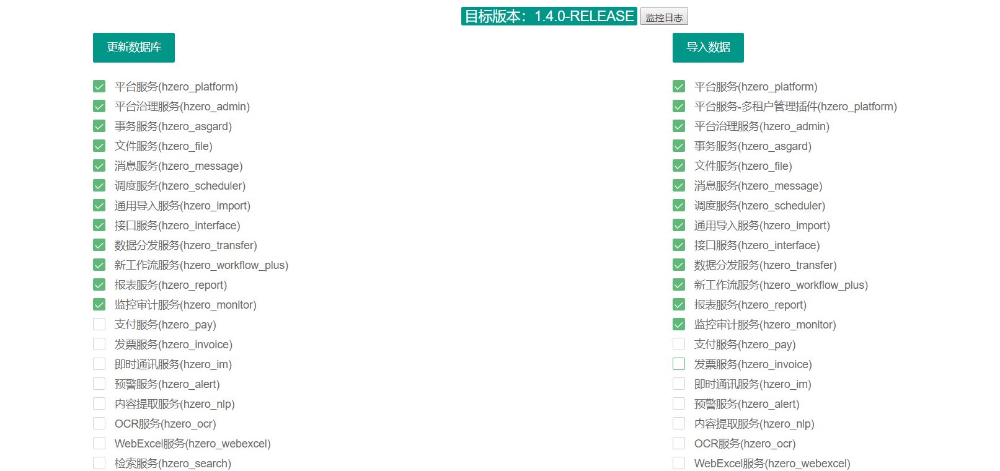
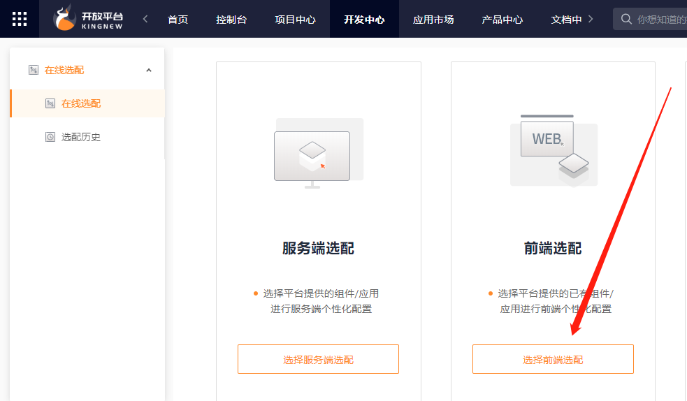

[link]: http://hzerodoc.saas.hand-china.com/zh/docs/installation-configuration/service-install/local-install/

------

# 后端部署

## 基础环境安装

安装清单

| 组件   | 描述                | 版本      |
| :----- | :------------------ | :-------- |
| JDK    | Java运行环境        | 1.8.0_172 |
| Nginx  | 前端代理            | 1.8.1     |
| Node   | JavaScript 运行环境 | 10.15.0   |
| Docker | 应用容器引擎        | 18.09.0   |
| Git    | 源码管理            | 2.9.4     |
| Maven  | 项目构建            | 3.3.9     |

------

### yum 源更新

- 进入源目录：`cd /etc/yum.repos.d/`

- 下载163源：`wget http://mirrors.163.com/.help/CentOS6-Base-163.repo`

- 把文件里面的$releasever全部替换为版本号6：`sed -i 's#$releasever#6#g' CentOS6-Base-163.repo`

- 清除原有缓存：`yum clean all`

- 重建缓存，以提高搜索安装软件的速度：`yum makecache`

- 更新系统：`yum update`

- gcc等环境安装，后续有些软件安装需要这些基础环境

  ```shell
  gcc安装：yum install gcc-c++
  PCRE pcre-devel 安装：yum install -y pcre pcre-devel
  zlib 安装：yum install -y zlib zlib-devel
  OpenSSL 安装：yum install -y openssl openssl-devel
  ```

------

### JDK

- 由于jdk下载需要接受条款的原因，建议下载后使用FlashFXP从本地上传到服务器。

- 进入/usr/local/src，解压jdk：`# tar -zxvf jdk-8u172-linux-x64.tar.gz`

- 将解压的jdk移动到/usr/local/：`# mv jdk1.8.0_172 /usr/local/`

- 配置环境变量：`# vim /etc/profile`，在最后添加如下环境变量

  ```shell
  export JAVA_HOME=/usr/local/jdk1.8.0_172
  export JRE_HOME=/usr/local/jdk1.8.0_172/jre
  export PATH=$JAVA_HOME/bin:$PATH
  export CLASSPATH=.:$JAVA_HOME/lib/tools.jar:$JRE_HOME/lib
  ```

- 保存退出后输入命令使配置生效：`# source /etc/profile`

- 验证jdk：`# java -version`

------

### Nginx

- 准备nginx：
  下载：`# wget http://nginx.org/download/nginx-1.8.1.tar.gz`
  解压：`# tar -zxvf nginx-1.8.1.tar.gz`
  进入目录：`# cd nginx-1.8.1`
- 配置nginx：`# ./configure --prefix=/usr/src/nginx --with-http_stub_status_module --with-http_ssl_module`
- 编译安装：`# make && make install`
- 查看nginx版本：
  进入安装目录：`# cd /usr/src/nginx/sbin`
  查看版本：`# ./nginx -v`
- 设置开机启动
  编辑/etc/rc.local：`# vim /etc/rc.local`
  添加一行：`/usr/src/nginx/sbin/nginx`，之后，开机会自动启动nginx
- nginx 命令
  进入nginx目录：`# cd /usr/src/nginx/sbin`
  启动服务：`# ./nginx`
  停止服务：`# ./nginx -s stop`
  重启服务：`# ./nginx -s reopen`
  重新载入配置文件：`# ./nginx -s reload`

------

### Node

- 准备 Node
  下载：`# wget https://nodejs.org/dist/v10.15.0/node-v10.15.0-linux-x64.tar.xz`
  解压：`# tar -xvf node-v10.15.0-linux-x64.tar.xz`
  移动到/usr/local/：`# mv node-v10.15.0-linux-x64 /usr/local/node-v10.15.0`

- 创建软链接：

  ```shell
  # ln -s /usr/local/node-v10.15.0/bin/node /usr/local/bin/node
  # ln -s /usr/local/node-v10.15.0/bin/npm /usr/local/bin/npm
  # ln -s /usr/local/node-v10.15.0/bin/npx /usr/local/bin/npx
  验证：
  # node -v
  # npm -v
  # npx -v
  ```

------

### Docker

- 卸载旧版本：`# yum remove docker docker-common docker-selinux`
- 安装需要的依赖包：`# yum install -y yum-utils device-mapper-persistent-data`
- 配置稳定仓库：`# yum-config-manager --add-repo https://download.docker.com/linux/centos/docker-ce.repo`
- 安装：`# yum install docker-ce`
- 启动docker：`# systemctl start docker`
- 加入开机启动：`# systemctl enable docker`
- 验证安装是否成功：`# docker -v`

------

### Git

- 准备Git
  下载：`wget https://www.kernel.org/pub/software/scm/git/git-2.9.4.tar.gz`
  解压：`tar -zxvf git-2.9.4.tar.gz`

- 安装编译Git时需要的包

  ```
  yum install curl-devel expat-devel gettext-devel openssl-devel zlib-devel
  yum install gcc perl-ExtUtils-MakeMaker
  ```

- 删除已有的git：`# yum remove git`

- 编译安装

  ```
  进入根目录：cd /usr/local/src/git-2.9.4
  安装到/usr/local/git目录：./configure --prefix=/usr/local/git
  编译安装：make && make install
  ```

- 创建软链：`# ln -s /usr/local/git/bin/* /usr/local/bin/`

- 检查安装是否成功：`# git --version`

可选部分：

- 生成 ssh-key：`# ssh-keygen -t rsa -C "xxx@hand-china.com"`
- 拷贝 id_rsa.pub 的SSH-Key 到 git


------

### Maven

- 准备maven
  下载：`# wget http://mirror.bit.edu.cn/apache/maven/maven-3/3.3.9/binaries/apache-maven-3.3.9-bin.tar.gz`
  解压：`# tar -zxvf apache-maven-3.3.9-bin.tar.gz`
  移动到/usr/local：`# mv apache-maven-3.3.9 /usr/local/maven3`

- 添加环境变量：`# vim /etc/profile`，在最后添加如下两行

  ```shell
  export MAVEN_HOME=/usr/local/maven3
  export PATH=$MAVEN_HOME/bin:$PATH
  ```

- 保存退出后输入命令使配置生效：`# source /etc/profile`

- 检验是否安装成功：`# mvn -v`

------

## 数据服务安装

安装清单

| 组件  | 描述         | 版本                         |
| :---- | :----------- | :--------------------------- |
| Redis | 缓存数据库   | 4.0.2                        |
| Mysql | 数据库       | 5.7.17                       |
| Minio | 对象存储服务 | RELEASE.2018-05-25T19-49-13Z |

- 创建数据目录：

  ```sh
  # mkdir -p /hzero/data-server/redis/data
  # mkdir -p /hzero/data-server/mysql/{mysql_cnf,mysql_data}
  ```

------

### Redis

- 拉取镜像：`# docker pull redis`
- 启动容器：`# docker run -d -p 6379:6379 --name redis -v /hzero/data-server/redis/data:/data redis`

------

### MySql

- 拉取镜像：`# docker pull registry.cn-hangzhou.aliyuncs.com/choerodon-tools/mysql:5.7.17`

- 数据库配置
  设置数据库表名不区分大小写，在 `/hzero/data-server/mysql/mysql_cnf` 下新建 `my.cnf` 文件，增加 `lower_case_table_names=1` ，其它配置可自行根据需求添加。

  ```shell
  [mysqld]
  lower_case_table_names=l
  max_connections=1000
  ```

- 启动容器：`# docker run -d -p 3306:3306 --name mysql -e MYSQL_ROOT_PASSWORD=root -v /hzero/data-server/mysql/mysql_data/:/var/lib/mysql/:rw -v /hzero/data-server/mysql/mysql_cnf:/etc/mysql/:rw --privileged=true 954`

- 创建用户：

  ```SQL
  create user 'hzero'@'%' identified by 'hzero';
  
  flush privileges;
  ```

------

### Minio

部署了文件服务且使用 Minio 的存储方式可安装 Minio。

- 拉取镜像：`# docker pull minio/minio:RELEASE.2018-05-25T19-49-13Z`

- 启动容器，端口 9000：`# docker run -d -p 9000:9000 --name minio -v /hzero/data-server/minio/data:/data -v /hzero/data-server/minio/config:/root/.minio 324b server /data`

- 获取用户名和密钥：`# docker logs minio`

  

------

## 域名映射

程序中基于域名映射各个服务器IP地址，因此需要在服务器和本地开发环境 `hosts` 文件中配置域名映射

```shell
192.168.xx.xxx db.hzero.org
192.168.xx.xxx redis.hzero.org
192.168.xx.xxx dev.hzero.org
```

------

## Jenkins 安装配置

- 拉取镜像：`# docker pull jenkins/jenkins:latest`

- 启动容器，端口 9090：`# docker run -d --name jenkins -p 9090:8080 -p 50000:50000 -v /hzero/data-server/jenkins:/home/jenkins_home --privileged=true jenkins/jenkins`

- 获取初始密码：`# docker logs jenkins`

  

- 访问 ip:9090 进入 jenkins 配置 

  

- 安装插件

  

- 设置用户

  

- 安装 `Publish Over SSH` 和 `SSH` 插件，用于连接各个服务

  

- 创建软链：Jenkins 通过shell脚本调用 java、mvn 等命令的时候，是从 /usr/bin 文件夹中找命令的，这个时候需要做个软链接

  ```shell
  ln -s  /usr/local/maven3/bin/mvn /usr/bin/mvn 
  ln -s /usr/local/jdk1.8.0_172/bin/jps /usr/bin/jps
  ln -s /usr/local/jdk1.8.0_172/bin/java /usr/bin/java
  ln -s /usr/local/jdk1.8.0_172/bin/javac /usr/bin/javac
  ```

------

## 表及数据初始化

### [**hzero-resource**](https://code.choerodon.com.cn/hzero-hzero/hzero-resource/tree/1.3.0.RELEASE) （1.4.0.RELEASE）

表结构及初始数据在 [**hzero-resource**](https://code.choerodon.com.cn/hzero-hzero/hzero-resource/tree/1.3.0.RELEASE) 项目下，请自行下载，并切换到对应版本分支上进行安装。

- groovy：表结构 groovy 脚本，提供了每个服务的表结构
- init-data：初始化数据，按服务划分基础数据
- tool-jar：执行初始化安装的工具
- database-init.sh：交互式执行初始化的脚本

------

### 运行安装工具

- hzero-resource 下提供了交互式脚本启动安装工具。

  - 在根目录下打开 bash 窗口，运行 database-init.sh 脚本
  - 按步骤选择安装的数据库类型、数据库连接信息、项目版本
  - 在浏览器中打开输出的地址

- 安装页面

  - 安装页面展示了当前版本及可以安装的服务和对应的数据，服务后显示的是对应的数据库schema。
  - 首先更新数据库，选择要更新的服务，再点击 `更新数据库` 即可，如果数据库不存在对应的 schema，会自动创建。
  - 数据库更新成功后，选择要更新的数据，再点击 `导入数据` 即可。

  

- Schema不一致处理

  如果数据库 schema 名称与标准的不一致，可以修改 `docs/mapping/service-mapping.xml` 文件中的映射关系

  - name: 服务名称
  - filename: 标准schema名称
  - schema: 实际schema名称，如果更改了名称，可修改此属性

  ```xml
  <service name="hzero-platform" filename="hzero_platform" schema="hzero_platform" description="平台服务"/>
  ```

- **注意**：如果是合到一个库中，需手动执行如下SQL删除数据权限中的表前缀数据，避免跨库查询。

  ```SQL
  DELETE FROM HPFM_PERMISSION_RULE WHERE RULE_TYPE_CODE = 'PREFIX';
  DELETE FROM HPFM_PERMISSION_REL R WHERE NOT EXISTS (SELECT 1 FROM HPFM_PERMISSION_RULE WHERE R.RULE_ID = RULE_ID);
  ```

------

### 默认登录用户

hzero-iam 的数据初始化好之后，默认的用户名密码为 [admin/Admin@123]，可使用此用户密码登陆系统。**安装完成后建议立即在个人中心修改默认密码。**

------

## 服务初始化

>  服务初始化前，请先确定项目或产品是使用SaaS版还是OP版，SaaS 版本支持多租户，OP版本没有租户概念。

接下来将通过[服务选配平台](http://hzero.saas.hand-china.com/hzeroStart/)快速创建HZERO依赖服务。

1.4.0以后：[汉得开放平台][http://open.hand-china.com/publish-center/service-match/history]

------

[CentOS中zip压缩和unzip解压缩命令详解][https://blog.csdn.net/CareChere/article/details/50844846]

`.zip`文件的压缩、解压：

```shell
# 压缩,把/home目录下面的mydata目录压缩为mydata.zip
zip -r mydata.zip mydata
# 解压,把/home目录下面的mydata.zip解压到mydatabak目录里面
unzip mydata.zip -d mydatabak
```

------

### Linux-jar包

Linux环境下，打包Java项目，生成`.jar`包：

##### 第一步：

`hzero-28250-parent`的安装（需要`hzero-28250-parent`父项目下的`pom.xml`文件）：

```
[root@db hzero-28250-parent]# mvn install
```

拓展（没有必要操作，也操作不了（需要Maven私服））：[Maven自动部署][https://www.runoob.com/maven/maven-deployment-automation.html]

##### 第二步：

需要修改相应路径`/hzero/projects/kong-register/src/main/resources`下的`bootstrap.yml`文档

需要将重复出现的`spring:`字条合并，如下：

```shell
# 更改结果
spring:
  application:
    name: hzero-register
  profiles:
    active: ${SPRING_PROFILES_ACTIVE:default} # 默认激活local，其他环境服务建议携带参数启动
```

##### 第三步：

将Java项目打包为`.jar`包，存放于`target`文件当中

```shell
[root@db kong-register]# mvn package
```

##### 第四步：

更改`run.sh`中的端口号为`management.port`，同时为`run.sh`赋予权限

```shell
# chmod u+x run.sh 
```

执行`run.sh`文档

```shell
# ./run.sh
或者
# sh run.sh
```

[run.sh][http://hzerodoc.saas.hand-china.com/files/docs/installation-configuration/install/run.sh] (若不使用GitLab方式，可将`git`注释)

##### 第五步：

执行`target`目录下的`kong-register.jar`文件

```shell
# java -jar kong-register.jar
```

注：若出现端口被占的报错

```shell
# netstat -napt | grep 8001
# kill -9 进程ID
```

------

MySQL权限配置

```sql
grant all privileges on `hzero_admin`.* to 'hzero'@'%';

grant all privileges on `hzero_asgard`.* to 'hzero'@'%';

grant all privileges on `hzero_file`.* to 'hzero'@'%';

grant all privileges on `hzero_import`.* to 'hzero'@'%';

grant all privileges on `hzero_interface`.* to 'hzero'@'%';

grant all privileges on `hzero_message`.* to 'hzero'@'%';

grant all privileges on `hzero_monitor`.* to 'hzero'@'%';

grant all privileges on `hzero_platform`.* to 'hzero'@'%';

grant all privileges on `hzero_report`.* to 'hzero'@'%';

grant all privileges on `hzero_scheduler`.* to 'hzero'@'%';

grant all privileges on `hzero_transfer`.* to 'hzero'@'%';

grant all privileges on `hzero_workflow_plus`.* to 'hzero'@'%';

flush privileges;
```

------

### 后台运行服务

[nohup和&后台运行，进程查看及终止][https://www.cnblogs.com/baby123/p/6477429.html]

```shell
nohup java -jar /hzero/projects/kong-register/target/app.jar >kong-register.log &
nohup java -jar /hzero/projects/kong-gateway/target/app.jar >kong-gateway.log &
nohup java -jar /hzero/projects/kong-oauth/target/app.jar >kong-oauth.log &
nohup java -jar /hzero/projects/kong-iam-saas/target/app.jar >kong-iam-saas.log &
nohup java -jar /hzero/projects/kong-platform/target/app.jar >kong-platform.log &
nohup java -jar /hzero/projects/kong-swagger/target/app.jar >kong-swagger.log &
nohup java -jar /hzero/projects/kong-config/target/app.jar >kong-config.log &
nohup java -jar /hzero/projects/kong-admin/target/app.jar >kong-admin.log &
# 若运行了run.sh，则调用以下命令
nohup java -jar /hzero/projects/kong-register/target/kong-register.jar >kong-register.log &
nohup java -jar /hzero/projects/kong-gateway/target/kong-gateway.jar >kong-gateway.log &
nohup java -jar /hzero/projects/kong-oauth/target/kong-oauth.jar >kong-oauth.log &
nohup java -jar /hzero/projects/kong-iam-saas/target/kong-iam-saas.jar >kong-iam-saas.log &
nohup java -jar /hzero/projects/kong-platform/target/kong-platform.jar >kong-platform.log &
nohup java -jar /hzero/projects/kong-swagger/target/kong-swagger.jar >kong-swagger.log &
nohup java -jar /hzero/projects/kong-config/target/kong-config.jar >kong-config.log &
nohup java -jar /hzero/projects/kong-admin/target/kong-admin.jar >kong-admin.log &
```

------

# 前端部署

## 开发环境

- 请确保如下环境变量已配置完成

  - node.js: v10.x or v8.x(>= v8.10)

    > 关于node.js请参考: https://nodejs.org/en/

  - 内存:

  - 开发者模式运行内存: >4GB

  - 生产环境编译运行内存: >4GB

  - yarn: 推荐使用yarn管理本项目

    > 执行如下命令全局安装yarn：`$ npm install --global yarn`
    >
    > 关于`yarn`请参考 [https://yarnpkg.com](https://yarnpkg.com/)

  - lerna: 用于管理具有多个`package`的`JavaScript`项目的工具。

    > A tool for managing JavaScript projects with multiple packages.
    >
    > 执行如下命令全局安装：`$ npm install --global lerna`
    >
    > 关于`lerna`请参考https://lernajs.io/
    >
    > 请注意安装完lerna,在linux服务器可能需要执行如下命令,才能使lerna生效
    >
    > ```sh
    > ln -s /usr/local/node-v10.15.0/bin/yarn /usr/local/bin/yarn
    > ln -s /usr/local/node-v10.15.0/bin/lerna /usr/local/bin/lerna
    > ```

  -  [hzero-front-cli](https://code.choerodon.com.cn/hzero-hzero/hzero-front-cli/)`npm install -g hzero-front-cli --registry=http://nexus.saas.hand-china.com/content/groups/hzero-npm-group/`（非必要，本地创建需要）

    > 升级 hzero-front-cli 请使用命令：`npm install -g hzero-front-cli@version --registry=http://nexus.saas.hand-china.com/content/groups/hzero-npm-group/`

  - 前端工程创建及部署请参考：[前端开发部署](http://hzerodoc.saas.hand-china.com/zh/docs/development-guide/front-develop-guid/start/)

------

### 在线前端选配

[汉得开放平台][http://open.hand-china.com/publish-center/service-match/create]

将创建好的前端选配文件通过本地上传或者GitLab的方式，将文件导入CnetOS7环境中

前端需要修改的部分：

```java
//路径：前端文件：src/config/.env.yml里面的API_HOST
//更改为：(网关的地址，以访问内部服务)(注意：最后不要加'/'，不然会报错)
API_HOST: http://192.168.81.129:8080
```

**注：**`'/'`报错的原因（500）

> 接口调用时，会调用http://196.128.81.129:8080//iam/xxx，即出现了`'//'`的情况，服务器无法识别与解析，所以会出现500报错

------

### CentOS7虚拟机需要修改的部分：

```shell
# vim /etc/profile
export PATH=/usr/local/node-v10.15.0/bin:$PATH
```



------

### jenkins-run-sh

- 服务器需要安装运行环境(以及编译环境)
  - nginx, node
  - yarn, lerna
- 脚本目录在 `**/srm-fornt/**.sh`
- nginx root 指向 `**/srm-fornt/html`

##### 第一步：

在前端文件的根目录下创建`run.sh`脚本：（根据实际需求更改）

```shell
#!/bin/sh

# git pull

gitPullErrorCode=$?

if [ 0 -ne $gitPullErrorCode ]; then
  echo "git pull error, try back yarn.lock, and pull again";
  mv yarn.lock "yarn.lock.`date +"%Y-%m-%d_%H-%M-%S"`.bakk" # decide yarn.lock has conflict
  git pull;
fi;

if [ 0 -ne $? ]; then
  exit "git pull error";
fi;

export PUPPETEER_SKIP_CHROMIUM_DOWNLOAD=true

yarn --registry http://nexus.saas.hand-china.com/content/groups/hzero-npm-group/
#yarn run build:dll
yarn build:dll
lerna run transpile
yarn build

buildErrorCode=$?

if [ 0 -ne $buildErrorCode ]; then
  echo $buildErrorCode
  echo 'build error';
  exit $buildErrorCode;
fi
cp -r dist dist.bak
# 环境变量根据项目情况更改
# BUILD_API_HOST：网关地址(需要更改成自己的网关服务地址)
find dist -name '*.js' | xargs sed -i "s BUILD_API_HOST http://192.168.81.129:8080 g"
find dist -name '*.js' | xargs sed -i "s BUILD_CLIENT_ID hzero-front-dev g"
find dist -name '*.js' | xargs sed -i "s BUILD_WEBSOCKET_HOST http://hzeronb.saas.hand-china.com/hpfm/sock-js g"
find dist -name '*.js' | xargs sed -i "s BUILD_PLATFORM_VERSION SAAS g"
find dist -name '*.js' | xargs sed -i "s BUILD_IM_ENABLE true g"
find dist -name '*.js' | xargs sed -i "s BUILD_IM_WEBSOCKET_HOST ws://192.168.16.150:9876 g"
find dist -name '*.js' | xargs sed -i "s BUILD_CUSTOMIZE_ICON_NAME customize-icon g"
rm -rf html
mv dist html
```

##### 第二步：

运行`run.sh`脚本

```shell
# sh run.sh
```

##### 第三步：

nginx root 指向 `**/srm-fornt/html`

```shell
#user  nobody;
worker_processes  1;

events {
    worker_connections  1024;
}

http {
    include       mime.types;
    default_type  application/octet-stream;

    sendfile        on;

    keepalive_timeout  65;

    server {
        listen       80;
        server_name  localhost;

        root /hzero/hzerofront/hzero-28250/html;
        #charset koi8-r;

        #access_log  logs/host.access.log  main;

        location / {
                try_files $uri /index.html;
        }

        #error_page  404              /404.html;

        # redirect server error pages to the static page /50x.html
        #
        error_page   500 502 503 504  /50x.html;
        location = /50x.html {
            root   html;
        }
    }
}
```

##### 第四步：

启动`nginx`

```shell
# cd /usr/src/nginx/sbin/
# ./nginx
```

##### 第五步：

打开浏览器，输入IP地址：http://196.128.81.129/

------

### 前端配置在本地

在前端的根目录下，执行以下命令即可

```shell
yarn
yarn build:dll
yarn build
yarn start
```

浏览器地址：http://localhost:8000

------

##### Vim 中如何去掉 ^M 字符？

删除行尾的^M：%s/\r//g

##### Vim中查找与替换

`:s`（substitute）命令用来查找和替换字符串。语法如下：

```shell
:{作用范围}s/{目标}/{替换}/{替换标志}
```

例如`:%s/foo/bar/g`会在全局范围(`%`)查找`foo`并替换为`bar`，所有出现都会被替换（`g`）。