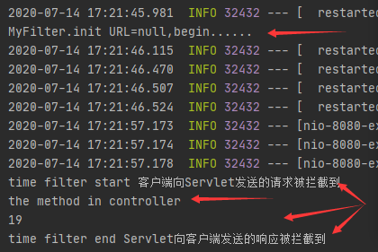

### Filter过滤器

首先我们说说什么是过滤器，过滤器是对数据进行过滤，预处理过程，当我们访问网站时，有时候会发布一些敏感信息，发完以后有的会用*替代，还有就是登陆权限控制等，一个资源，没有经过授权，肯定是不能让用户随便访问的，这个时候，也可以用到过滤器。过滤器的功能还有很多，例如实现URL级别的权限控制、压缩响应信息、编码格式等等。

<font color='red'>过滤器依赖servlet容器</font>。在实现上基于函数回调，可以对几乎所有请求进行过滤。下面简单的说说Spring Boot里面如何增加过滤器。

------


### @WebFilter+@ServletComponentScan版本

- 引入spring-boot-starter-web依赖，在pom.xml 中引入spring-boot-starter-web包。

```java
<dependencies>
        <dependency>
            <groupId>org.springframework.boot</groupId>
            <artifactId>spring-boot-starter</artifactId>
        </dependency>
    
        <dependency>
            <groupId>org.springframework.boot</groupId>
            <artifactId>spring-boot-starter-web</artifactId>
        </dependency>
    </dependencies>
```


- 建立过滤器程序
  - @Order(1)：表示过滤器的顺序，假设我们有多个过滤器，你如何确定过滤器的执行顺序？这个注解就是规定过滤器的顺序。
  - @WebFilter：表示这个class是过滤器。
  - 里面的参数：filterName 为过滤器名字，urlPatterns 为过滤器的范围，initParams 为过滤器初始化参数。
  - 过滤器里面的三个方法
  - init ： filter对象只会创建一次，init方法也只会执行一次。
  - doFilter ： 主要的业务代码编写方法，可以多次重复调用
  - destroy ： 在销毁Filter时自动调用（程序关闭或者主动销毁Filter）

> 注意：导入Filter的接口包为
>
> ```java
> import javax.servlet.Filter;
> ```

```java
package com.kszhub.demo.filter;

@Order(1)
@WebFilter(filterName = "myFilter", urlPatterns = "/*", initParams = {
        @WebInitParam(name = "url", value = "http://localhost:8080/")
})
public class MyFilter implements Filter {
    private String url;

    /**
     * 可以初始化Filter在web.xml里面配置的初始化参数
     * filter对象只会创建一次，init方法也只会执行一次。
     * @param filterConfig
     * @throws ServletException
     */
    @Override
    public void init(FilterConfig filterConfig) throws ServletException {
        this.url = filterConfig.getInitParameter("URL");
        System.out.println("MyFilter.init URL="+this.url+",begin......");
    }

    /**
     * 在销毁Filter时自动调用。
     */
    @Override
    public void destroy() {
        System.out.println("MyFilter.destroy end......");
    }

    /**
     * 主要的业务代码编写方法
     * @param request
     * @param response
     * @param chain
     * @throws IOException
     * @throws ServletException
     */
    @Override
    public void doFilter(ServletRequest request, ServletResponse response, FilterChain chain) throws IOException, ServletException {
        System.out.println("time filter start 客户端向Servlet发送的请求被拦截到");
        long start = System.currentTimeMillis();
        chain.doFilter(request, response);
        System.out.println(System.currentTimeMillis() - start);
        System.out.println("time filter end Servlet向客户端发送的响应被拦截到");
    }
}

```


- 建立Contoller类（这个类比较简单，不做特别说明）

```java
package com.kszhub.demo.controller;

@RestController
public class MyController {
    @RequestMapping(value = "/query")
    public void asyncTask() throws Exception{
        System.out.println("the method in controller");
    }
}

```


- 启动类中增加注解，自动注册Filter

  **@ServletComponentScan** ：在SpringBootApplication上使用@ServletComponentScan注解后，Servlet、Filter、Listener可以直接通过@WebServlet、@WebFilter、@WebListener注解自动注册，无需其他代码。

```java
package com.kszhub.demo;

@SpringBootApplication
@ServletComponentScan
public class DemoApplication {

    public static void main(String[] args) {
        SpringApplication.run(DemoApplication.class, args);
    }

}

```


- 测试结果



------


### @Component版本

- springboot 配置自定义的过滤器需要将自定义的过滤配实现 **javax.servlet.Filter**接口

  Description：**过滤器处理<font color='red'>所有请求</font>**

  - 这里写两种配置方式：一种在myFilter类上加上@Component注解，
   * 另一种不添加这个注解，在config包下创建一个配置类config.WebConfig，通过配置Bean

- demo1：在自定义过滤器上添加组件注解

```java
package com.kszhub.demo.filter;

@Component
public class MyFilter implements Filter {
    @Override
    public void init(FilterConfig filterConfig) throws ServletException {
        System.out.println("MyFilter.init");
    }

    @Override
    public void destroy() {
        System.out.println("MyFilter.destroy");
    }

    @Override
    public void doFilter(ServletRequest request, ServletResponse response, FilterChain chain) throws IOException, ServletException {
        System.out.println("time filter start");
        long start = System.currentTimeMillis();
        chain.doFilter(request, response);
        System.out.println(System.currentTimeMillis() - start);
        System.out.println("time filter end");
    }
}

```


- 第二种就是将上面的注解去掉，在自定义config中用配置Bean的方式装配

```java
//WebConfig.java
package com.kszhub.demo.config;

/**
 * Configuration注解配置很重要
 */
@Configuration
public class WebConfig {
    @Bean
    public FilterRegistrationBean timeFilter(){
        FilterRegistrationBean registrationBean = new FilterRegistrationBean();
        MyFilter myFilter = new MyFilter();
        registrationBean.setFilter(myFilter);
        ArrayList<String> urls = new ArrayList<>();
        urls.add("/*");//配置过滤规则
        registrationBean.setUrlPatterns(urls);
        return registrationBean;
    }
}

```

```java
//MyFilter.java
package com.kszhub.demo.filter;

public class MyFilter implements Filter {
    @Override
    public void init(FilterConfig filterConfig) throws ServletException {}

    @Override
    public void destroy() {}

    @Override
    public void doFilter(ServletRequest request, ServletResponse response, FilterChain chain) throws IOException, ServletException {}
}
```


- 测试，结果正确（可行）

