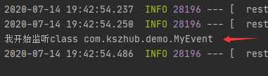
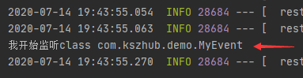
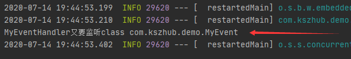

# 监听器Listener

监听器也叫Listener,是servlet的监听器，可以用于监听Web应用中某些对象（servletContext、HttpSession和servletRequest等域对象），信息的创建，销毁，增加，修改，删除等动作的发生，然后做出相应的响应处理。当范围对象的状态发生变化时，服务器自动调用监听器对象中的方法，常用于统计在线人数和在线用户，系统加载时进行信息初始化，统计网站的访问量等。

**简单事件监听流程：**

1.自定义事件，一般是继承ApplicationEvent抽象类

2.定义事件监听器，一般是实现ApplicationListener接口

3.启动的时候，需要把监听器加入到spring容器中

4.发布事件：ApplicationContext.publishEvent发布事件

**配置监听器的方法：**

1.context.addApplicationListener(new Mylistener())

2.把监听器加入到spring容器中管理

3.在application.properties文件中使用context.listenser.classes配置配置项在application.properties如此写： #context.listener.classes= com.example.demo.Mylistener

4.使用@EventListener注解，在方法上面加入@EventListener注解，同时该类需要纳入到spring容器中管理

------


### 事件监听

- MyEvent.java，定义事件

```java
package com.kszhub.demo;

public class MyEvent extends ApplicationEvent {
    private static final long serialVersionUID = 1L;

    public MyEvent(Object source) {
        super(source);
    }
}

```


#### 方法一（实现ApplicationListener<>接口 + @Component）

- MyListener.java，定义事件监听器

```java
package com.kszhub.demo;

@Component
public class MyListener implements ApplicationListener<MyEvent> {
    //<写要监听的事件>

    @Override
    public void onApplicationEvent(MyEvent event) {
        System.out.println("我开始监听"+event.getClass());
    }
}

```


- SpringbootApplication.java

```java
package com.kszhub.demo;

@SpringBootApplication
public class DemoApplication {

    public static void main(String[] args) {
        ConfigurableApplicationContext context = SpringApplication.run(DemoApplication.class, args);

        context.publishEvent(new MyEvent(new Object()));//发布事件
        context.close();
    }

}

```


- 测试结果




#### 方法二（实现ApplicationListener<>接口 + 无@Component）

- MyListener.java，定义事件监听器

```java
package com.kszhub.demo;

public class MyListener implements ApplicationListener<MyEvent> {
    //<写要监听的事件>

    @Override
    public void onApplicationEvent(MyEvent event) {}
}

```


- SpringbootApplication.java

```java
package com.kszhub.demo;

@SpringBootApplication
public class DemoApplication {

    public static void main(String[] args) {
        ConfigurableApplicationContext context = SpringApplication.run(DemoApplication.class, args);

        context.addApplicationListener(new MyListener());//启动的时候，需要把监听器加入到spring容器中
        //如果这里不把监听器加入到spring容器中，那么需要在监听器类中加上@component,标注,具体见如下MyEventHandler.java
        context.publishEvent(new MyEvent(new Object()));//发布事件
        context.close();
    }

}

```

如果不想把监听器加入到Spring容器中，需要使用@Component注解


- 测试结果




#### 方法三（@EventListener）

- MyEventHandler.java

```java
package com.kszhub.demo;

@Component
public class MyEventHandler {

    @EventListener
    public void event(MyEvent event){
        /**
         * 括号中的参数不能为空，可以任意
         * 若为Object event，则所有事件都可以监听到
         */
        System.out.println("MyEventHandler又要监听"+event.getClass());
    }
}

```


- SpringbootApplication.java

```java
package com.kszhub.demo;

@SpringBootApplication
public class DemoApplication {

    public static void main(String[] args) {
        ConfigurableApplicationContext context = SpringApplication.run(DemoApplication.class, args);

        context.publishEvent(new MyEvent(new Object()));//发布事件
        context.close();
    }

}

```


- 测试结果



------


### 整理一份常用的监听器接口：

1.ServletContextListener – 监听servletContext对象的创建以及销毁

```markdown
contextInitialized(ServletContextEvent arg0)   -- 创建时执行

contextDestroyed(ServletContextEvent arg0)  -- 销毁时执行
```

2.HttpSessionListener  – 监听session对象的创建以及销毁

```markdown
sessionCreated(HttpSessionEvent se)   -- 创建时执行

sessionDestroyed(HttpSessionEvent se) -- 销毁时执行
```

3.ServletRequestListener – 监听request对象的创建以及销毁

```markdown
requestInitialized(ServletRequestEvent sre) -- 创建时执行

requestDestroyed(ServletRequestEvent sre) -- 销毁时执行
```

4.ServletContextAttributeListener  – 监听servletContext对象中属性的改变

```markdown
attributeAdded(ServletContextAttributeEvent event) -- 添加属性时执行

attributeReplaced(ServletContextAttributeEvent event) -- 修改属性时执行

attributeRemoved(ServletContextAttributeEvent event) -- 删除属性时执行
```

5.HttpSessionAttributeListener  --监听session对象中属性的改变

```markdown
attributeAdded(HttpSessionBindingEvent event) -- 添加属性时执行

attributeReplaced(HttpSessionBindingEvent event) -- 修改属性时执行

attributeRemoved(HttpSessionBindingEvent event) -- 删除属性时执行
```

6.ServletRequestAttributeListener  --监听request对象中属性的改变

```markdown
attributeAdded(ServletRequestAttributeEvent srae) -- 添加属性时执行

attributeReplaced(ServletRequestAttributeEvent srae) -- 修改属性时执行

attributeRemoved(ServletRequestAttributeEvent srae) -- 删除属性时执行
```


