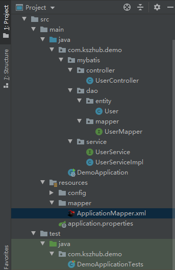
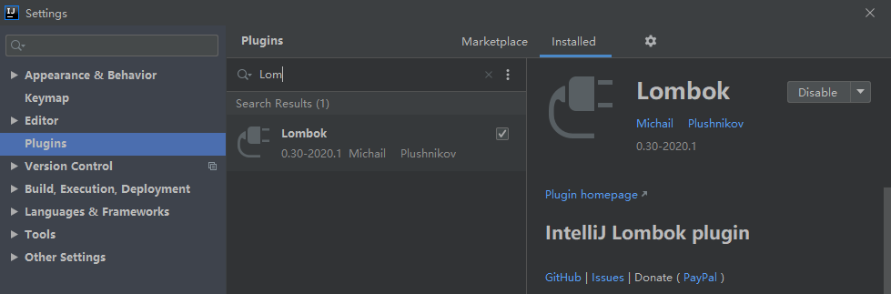
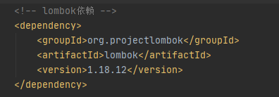

# 注解版本

- 数据库初始化


- SpringBoot项目创建


- 导入相关依赖

pom.xml文件

```java
<dependencies>
        <dependency>
            <groupId>org.springframework.boot</groupId>
            <artifactId>spring-boot-starter</artifactId>
        </dependency>
        <dependency>
            <groupId>org.springframework.boot</groupId>
            <artifactId>spring-boot-starter-web</artifactId>
        </dependency>
        <dependency>
            <groupId>org.springframework.boot</groupId>
            <artifactId>spring-boot-devtools</artifactId>
            <optional>true</optional>
        </dependency>

        <!-- mysql -->
        <dependency>
            <groupId>mysql</groupId>
            <artifactId>mysql-connector-java</artifactId>
            <version>8.0.20</version>
        </dependency>
        <dependency>
            <groupId>org.springframework.boot</groupId>
            <artifactId>spring-boot-starter-jdbc</artifactId>
            <version>2.3.1.RELEASE</version>
        </dependency>

        <!-- mybatis依赖 -->
        <dependency>
            <groupId>org.mybatis.spring.boot</groupId>
            <artifactId>mybatis-spring-boot-starter</artifactId>
            <version>1.3.2</version>
        </dependency>
    </dependencies>
```


- 更改application.properties配置文件

```java
server.port=8080

# mysql配置信息
spring.datasource.url=jdbc:mysql://47.110.239.242:3307/HZERO
spring.datasource.username=root
spring.datasource.password=admin
spring.datasource.driver-class-name=com.mysql.cj.jdbc.Driver

# mybatis配置信息
mybatis.type-aliases-package=com.kszhub.demo.mybatis.dao
```

Mapper.xml中的resultType中经常会用到一些自定义POJO，你可以用完全限定名来指定这些POJO的引用，例如

```java
<select id="getUsers" resultType="com.kszhub.demo.mybatis.dao.User">
```

又或者你可以通过在application.properties中指定<font color='red'>POJO扫描包</font>来让mybatis自动扫描到自定义POJO，如下：

```java
mybatis.type-aliases-package=com.kszhub.demo.mybatis.dao
```

但是，请千万注意，不要再`mybatis.type-aliases-package=`后面接`classpath`这个单词，否则，mybatis会找不到POJO。


- 新建dao包，在dao包下新建User类

```java
package com.kszhub.demo.mybatis.dao;

public class User {
    private int id;
    private String name;
    private String password;
	//有参、无参构造函数
    //get、set、toString方法
}

```

这个类是和数据库中的User类一一对应的。


- 新建mapper包，在mapper新建UserMapper类

在这个类中，我们实现基本的增删改查功能接口：

```java
package com.kszhub.demo.mybatis.mapper;

@Mapper
public interface UserMapper {
    @Insert("insert into `User`(`id`,`name`,`password`) values(#{id},#{name},#{password})")
    int insert(User user);
    
    @Delete("delete from `User` where `id` = #{id}")
    int deleteByPrimaryKey(Integer id);
    
    @Update("update `User` set `name` = #{name},`password` = #{password} where `id` = #{id}")
    int updateByPrimaryKey(User user);
    
    @Select("select `id`,`name`,`password` from `User` where id=#{id}")
    User selectByPrimaryKey(Integer id);
    
    @Select("select `id`,`name`,`password` from `User`")
    List<User> selectAllUser();
}

```

这就是最基本的一个增删改查操作的接口。


- 新建service包，在service包创建UserService接口

```java
package com.kszhub.demo.mybatis.service;

public interface UserService {
    int insertUser(User user);
    int deleteByUserId(Integer id);
    int updateByUser(User user);
    User selectByUserId(Integer id);
    List<User> selectAllUser();
}

```


- 在service包下创建UserServiceImpl接口实现类

```java
package com.kszhub.demo.mybatis.service;

@Service
public class UserServiceImpl implements UserService {
    @Autowired
    private UserMapper userMapper;

    @Override
    public int insertUser(User user) {
        return userMapper.insert(user);
    }

    @Override
    public int deleteByUserId(Integer id) {
        return userMapper.deleteByPrimaryKey(id);
    }

    @Override
    public int updateByUser(User user) {
        return userMapper.updateByPrimaryKey(user);
    }

    @Override
    public User selectByUserId(Integer id) {
        return userMapper.selectByPrimaryKey(id);
    }

    @Override
    public List<User> selectAllUser() {
        return userMapper.selectAllUser();
    }
}

```


- 编写controller层

```java
package com.kszhub.demo.mybatis.controller;

@RestController
public class UserController {
    @Autowired
    private UserService userService;
    @RequestMapping(value = "/add")
    public String user(){
        User user = new User();
        user.setId(4);
        user.setName("ksz");
        user.setPassword("444");
        int result = userService.insertUser(user);
        System.out.println("插入结果：" + result);
        return result+"";
    }
    @RequestMapping(value = "/findAll")
    public String findAll(){
        List<User> users = userService.selectAllUser();
        users.stream().forEach(System.out::println);
        return users.toString()+"";
    }
}

```


- 在启动主类添加扫描器

```java
package com.kszhub.demo;

@SpringBootApplication
@MapperScan("com.kszhub.demo.mybatis.mapper")
public class DemoApplication {

    public static void main(String[] args) {
        SpringApplication.run(DemoApplication.class, args);
    }

}

```

若在UserMapper类中已添加了注解`@Mapper`，则在启动主类中无需添加扫描器`@MapperScan()`。


- 测试

在浏览器输入相应的路径即可。

------


# XML配置文件版本

- SpringBoot项目创建



- 添加MySQL 连接驱动依赖、SpringBoot Mybatis 依赖，完整pom文件如下：

```java
<dependencies>
        <dependency>
            <groupId>org.springframework.boot</groupId>
            <artifactId>spring-boot-starter</artifactId>
        </dependency>
        <dependency>
            <groupId>org.springframework.boot</groupId>
            <artifactId>spring-boot-starter-web</artifactId>
        </dependency>

        <!-- mysql -->
        <dependency>
            <groupId>mysql</groupId>
            <artifactId>mysql-connector-java</artifactId>
            <version>8.0.20</version>
        </dependency>
        <dependency>
            <groupId>org.springframework.boot</groupId>
            <artifactId>spring-boot-starter-jdbc</artifactId>
            <version>2.3.1.RELEASE</version>
        </dependency>

        <!-- mybatis依赖 -->
        <dependency>
            <groupId>org.mybatis.spring.boot</groupId>
            <artifactId>mybatis-spring-boot-starter</artifactId>
            <version>1.3.2</version>
        </dependency>

        <!-- lombok依赖 -->
        <dependency>
            <groupId>org.projectlombok</groupId>
            <artifactId>lombok</artifactId>
            <version>1.18.12</version>
        </dependency>

        <!-- logback依赖 -->
        <dependency>
            <groupId>ch.qos.logback</groupId>
            <artifactId>logback-classic</artifactId>
        </dependency>

        <!-- slf4j依赖 -->
        <dependency>
            <groupId>org.slf4j</groupId>
            <artifactId>jcl-over-slf4j</artifactId>
        </dependency>
    </dependencies>
```


- 配置application.properties文件

```java
server.port=8080

# mysql配置信息
spring.datasource.url=jdbc:mysql://47.110.239.242:3307/HZERO
spring.datasource.username=root
spring.datasource.password=admin
spring.datasource.driver-class-name=com.mysql.cj.jdbc.Driver

# mybatis配置信息
#mybatis.config-location=classpath:config/*Config.xml
mybatis.mapper-locations=classpath:mapper/*Mapper.xml
mybatis.type-aliases-package=com.kszhub.demo.mybatis.dao
```

注：通常，若mybatis配置信息较少，只是针对基本配置无需复杂配置，则只需在application.properties文件中配置即可，否则最好配置在 *Config.xml中。


- controller层代码实现

```java
package com.kszhub.demo.mybatis.controller;

@Slf4j
@RestController
@RequestMapping("/web")
public class UserController {
    @Autowired
    private UserService userService;

    @RequestMapping(value = "/queryAllUsers")
    public List<User> queryAllUsers(){
        return userService.queryAllUsers();
    }

    @RequestMapping(value = "/addUser")
    public int insertUser(){
        User user = new User();
        user.setId(5);
        user.setName("eee");
        user.setPassword("555");
        return userService.insertUser(user);
    }
}

```

jcl-over-slf4j依赖：

@Slf4j : 注解在类上, 为类提供一个属性名为 log 的 log4j 的日志对象


- service层（接口）代码实现

```java
package com.kszhub.demo.mybatis.service;

public interface UserService {
    public List<User> queryAllUsers();
    public int insertUser(User user);
}

```


- service层（实现）代码实现

```java
package com.kszhub.demo.mybatis.service;

@Slf4j
@Service
public class UserServiceImpl implements UserService {
    @Autowired
    private UserMapper userMapper;

    @Override
    public List<User> queryAllUsers() {
//        log.info("/queryAllUsers start...");
        return userMapper.queryAllUsers();
    }

    @Override
    public int insertUser(User user) {
        return userMapper.insertUser(user);
    }
}

```


- dao层代码实现

  dao层分为数据库实体类（entity）和数据库操作mapper接口（mapper）

  - entity：

  ```java
  package com.kszhub.demo.mybatis.dao.entity;
  
  @Data
  public class User {
      private int id;
      private String name;
      private String password;
  }
  
  ```

  lombok依赖：

  <font color='red'>@Data</font> : 注解在类上, 为类提供读写属性, 此外还提供了 equals()、hashCode()、toString() 方法

  @Getter/@Setter : 注解在类上, 为类提供读写属性

  @ToString : 注解在类上, 为类提供 toString() 方法

  @AllArgsConstructor：使用后添加一个构造函数，该构造函数含有所有已声明字段属性参数

  @NoArgsConstructor：使用后创建一个无参构造函数

  @Builder：关于Builder较为复杂一些，Builder的作用之一是为了解决在某个类有很多构造函数的情况，也省去写很多构造函数的麻烦，在设计模式中的思想是：**用一个内部类去实例化一个对象，避免一个类中出现过多构造函数。**

  > **条件：**
  >
  > 1. IDEA需要安装Lombok插件
  >
  >    
  >
  > 2. pom.xml文件中需要导入lombok依赖
  >
  >    

  

  - mapper：

  ```java
  package com.kszhub.demo.mybatis.dao.mapper;
  
  public interface UserMapper {
      List<User> queryAllUsers();
      int insertUser(User user);
  }
  
  ```

  

- mapper.xml代码实现

```java
<?xml version="1.0" encoding="UTF-8" ?>
<!DOCTYPE mapper PUBLIC "-//mybatis.org//DTD Mapper 3.0//EN" "http://mybatis.org/dtd/mybatis-3-mapper.dtd" >

<mapper namespace= "com.kszhub.demo.mybatis.dao.mapper.UserMapper" >
    <resultMap id ="UserInfoMap" type="com.kszhub.demo.mybatis.dao.entity.User">
        <result column="id" property="id"/>
        <result column="name" property="name"/>
        <result column="password" property="password"/>
    </resultMap>

    <select id = "queryAllUsers" resultMap="UserInfoMap">
        select `id`,`name`,`password` from User
    </select>
    
    <insert id="insertUser">
        insert into User(`id`,`name`,`password`) values (#{id},#{name},#{password})
    </insert>
    
<!--    <delete></delete>-->
<!--    <update></update>-->
</mapper>

```


- config.xml代码实现

```java
<?xml version="1.0" encoding="UTF-8" ?>
<!DOCTYPE configuration PUBLIC "-//mybatis.org//DTD Config 3.0//EN" "http://mybatis.org/dtd/mybatis-3-config.dtd" >

<configuration>
	......
</configuration>
```


- 测试

在浏览器输入相应的路径即可。
