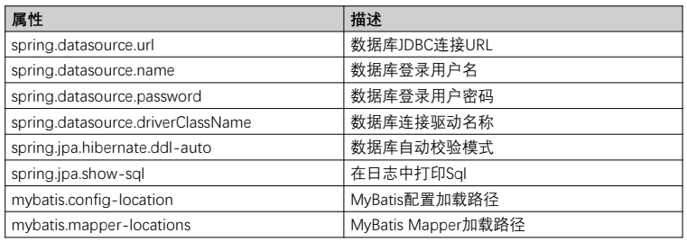

依赖：

```java
<!-- 添加 MySQL -->
<dependency>
	<groupId>mysql</groupId>
	<artifactId>mysql-connector-java</artifactId>
	<version>5.1.41</version>
</dependency>
```


application.properties文件

```java
server.port=8080

# mysql配置信息
spring.datasource.url=jdbc:mysql://47.110.239.242:3307/HZERO
spring.datasource.username=root
spring.datasource.password=admin
spring.datasource.driver-class-name=com.mysql.jdbc.Driver
```




DemoApplicationTests文件

```java
@SpringBootTest
class DemoApplicationTests {

    @Autowired
    private JdbcTemplate jdbcTemplate;

    @Test
    void contextLoads() {
    }

    @Test
    public void testMysql(){
        List<Map<String,Object>> result = jdbcTemplate.queryForList("select * from `table1`");
        System.out.println("query result is " + result.size());
        System.out.println("success1");
    }

    @Test
    public void testMySqlForUpdate(){
        jdbcTemplate.execute("update `table1` set `function`='123' where `id`='1'");
        System.out.println("success2");
    }

}
```


HelloController.java文件

```java
@RestController
public class HelloController {
	
	@Autowired
    JdbcTemplate jdbcTemplate;
	
	@RequestMapping(value="/hello", method=RequestMethod.GET)
    public String index() {
		
		String sql = "SELECT mobile FROM user WHERE id = ?";
		
		// 通过jdbcTemplate查询数据库
		String mobile = (String)jdbcTemplate.queryForObject(
				sql, new Object[] { 1 }, String.class);
		
        return "Hello " + mobile;
    }
}
```


[java中使用jdbcTemplate的query方法举例与总结](https://www.cnblogs.com/wxs8088/p/5576656.html)             


在java中使用JdbcTemplate进行查询时，可以使用queryForXXX()等方法

1、`jdbcTemplate.queryForInt()` 和 `jdbcTemplate.queryForLong()`

//查询数据记录的条数，返回一个int(数据范围较小)或者一个Long（数据范围较大）类型

```java
String todayCountTopicsSql="SELECT count(*) FROM mcp_forum_post"; 

Integer todayCount=jdbcTemplate.queryForInt(todayCountTopicsSql);

//也可以：
Long  todayCount=jdbcTemplate.queryForLong(todayCountTopicsSql);
```


2、 `jdbcTemplate.queryForObject ()`

本质上和queryForInt()相同，返回都是单行单列一个数据，例如传回一个String对象：  

```java
String userAccountSql="select account from scpn_user where user_id="+userAccountId; 
String userAccount=(String)jdbcTemplate.queryForObject(userAccountSql, java.lang.String.class);
```


3、`jdbcTemplate.queryForMap()`

查询一行数据，即一条记录，一条记录包含多个字段, 使用返回的列做key。

```java
String userAccountSql="select account,create_time from scpn_user where user_id="+userAccountId;
Map userAccountMap=(Map)jdbcTemplate.queryForMap(userAccountSql);
String userAccount= (String)userAccountMap.get("account");    //取出数据库中char类型的数据转换为String
String createTime= (String)userAccountMap.get("create_time").toString();  //取出数据库中datetime类型的数据转换为String
```


4、 `jdbcTemplate.queryForList()`

返回Map的集合List（它包含多条记录）, 用列名做key， 每一个map代表一条数据库记录，需要使用循环来输出每一条记录，如果想在结果集中加入一个字段，也可以采用如下的put方法。

```java
String all="SELECT * FROM mcp_forum_post";
List scpnPostList = jdbcTemplate.queryForList(all);
if (scpnPostList!=null) {
	for (int i = 0; i < scpnPostList.size(); i++) {
        Long userAccountId = (Long) scpnPostList.get(i).get("user_id");
        Long lastmodUser = (Long) scpnPostList.get(i).get("lastmod_user");
		if (lastmodUser!=null) {
			String lastmodUserSql="select account from scpn_user where user_id="+lastmodUser;
			String lastmodUserAccount = (String)jdbcTemplate.queryForObject(lastmodUserSql, java.lang.String.class);
			scpnPostList.get(i).put("lastmodUserAccount", lastmodUserAccount);//可以在结果集中插入一个字段
		}
	}
}
```

