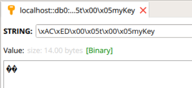

在这里说一下Jedis和Lettuce的区别在哪？

1、Jedis 是直连模式，在多个线程间共享一个 Jedis 实例时是<font color='red'>线程不安全</font>的，每个线程都去拿自己的 Jedis 实例，当连接数量增多时，物理连接成本就较高了。

2、Lettuce的连接是基于Netty的，连接实例可以在多个线程间共享，如果你不知道Netty也没事，大致意思就是一个多线程的应用可以使用同一个连接实例，而不用担心并发线程的数量。通过异步的方式可以让我们更好地利用系统资源。

------

在SpringBoot中一般使用RedisTemplate提供的方法来操作Redis。那么使用SpringBoot整合Redis
需要那些步骤呢。

1. JedisPoolConfig(这个是配置连接池)
2. RedisConnectionFactory（这个是配置连接信息，这里的RedisConnectionFactory是一个接口，
   我们需要使用它的实现类，在SpringD Data Redis方案中提供了一下四种工厂模型）
   - `JredisConnectionFactory`
   - `JedisConnectionFactory`
   - `LettuceConnectionFactory`
   - `SrpConnectionFactory`
3. RedisTemplate

------


# Lettuce版本

- 添加依赖

```java
<dependencies>
        <dependency>
            <groupId>org.springframework.boot</groupId>
            <artifactId>spring-boot-starter</artifactId>
        </dependency>

        <!-- spring boot redis 缓存导入 -->
        <dependency>
            <groupId>org.springframework.boot</groupId>
            <artifactId>spring-boot-starter-data-redis</artifactId>
        </dependency>
        <!-- lettuce pool 缓存连接池 -->
        <dependency>
            <groupId>org.apache.commons</groupId>
            <artifactId>commons-pool2</artifactId>
        </dependency>
    </dependencies>
```


- application.properties配置文件

```java
server.port=8080
# Redis数据库索引（默认为0）
spring.redis.database=1
# Redis服务器地址
spring.redis.host=47.110.239.242
# Redis服务器连接端口
spring.redis.port=6379
# Redis服务器连接密码（默认为空）
spring.redis.password=
# 连接池最大的连接数（使用负值表示没有限制）默认8
spring.redis.lettuce.pool.max-active=8
# 连接池最大的阻塞等待时间（使用负值表示没有限制）默认-1
spring.redis.lettuce.pool.max-wait=-1
# 连接池中的最大空闲连接 默认8
spring.redis.lettuce.pool.max-idle=8
# 连接池中的最小空闲连接 默认0
spring.redis.lettuce.pool.min-idle=0
```


- 新建config包，创建RedisConfig类

默认情况下RedisTemplate模板只能支持字符串，我们自定义一个RedisTemplate，<font color='red'>设置序列化器</font>，这样我们可以很方便的操作实例对象。

```java
package com.kszhub.demo.config;

@Configuration
public class RedisConfig {
    @Bean
    public RedisTemplate<String, Serializable> redisTemplate(LettuceConnectionFactory connectionFactory){
        RedisTemplate<String, Serializable> redisTemplate = new RedisTemplate<>();
        redisTemplate.setKeySerializer(new StringRedisSerializer());
        redisTemplate.setValueSerializer(new GenericJackson2JsonRedisSerializer());
        redisTemplate.setConnectionFactory(connectionFactory);
        return redisTemplate;
    }
}

```


- 新建bean包，创建User类

```java
package com.kszhub.demo.bean;

import java.io.Serializable;

/**
 * @author Kong
 * @date 2020/7/14 15:43
 */
public class User implements Serializable {
    private Integer id;
    private String userName;
    private String userSex;
	//有参、无参构造函数
    //set、get、toString方法
}

```


- 测试插入一个User

```java
package com.kszhub.demo;

@SpringBootTest
class DemoApplicationTests {
    @Autowired
    private RedisTemplate redisTemplate;

    @Test
    public void testObj() throws Exception{
        User user = new User(1, "ksz", "man");
        ValueOperations<String, User> operations = redisTemplate.opsForValue();
        operations.set("ksz", user);
        boolean exists = redisTemplate.hasKey("ksz");
        System.out.println("redis是否存在相应的key "+exists);
        User getUser = (User)redisTemplate.opsForValue().get("ksz");
        System.out.println("从redis数据库中获取的user："+getUser.toString());
    }
}
```


在上面这个例子中我们使用redisTemplate调用了opsForValue会得到一个ValueOperations操作。这个是专门操作String类型的数据，所以里面的键值对中键为String，而值是我们的User。当然redisTemplate还为我们提供了下面几个。

```java
redisTemplate.opsForValue();//操作字符串
redisTemplate.opsForHash();//操作hash
redisTemplate.opsForList();//操作list
redisTemplate.opsForSet();//操作set
redisTemplate.opsForZSet();//操作有序set
```

具体使用的时候，你可以根据自己的数据类型选择相应的方法即可，网上有各种**RedisUtil工具类**。

------


# 序列化器

这里先说一下Spring提供了那些序列化器（各自作用自行百度，这里不再赘述）

> Jackson2JsonRedisSerializer
>
> JdkSerializationRedisSerializer
>
> OxmSerializer
>
> StringRedisSerializer
>
> GenericToStringRedisSerializer
>
> GenericJackson2JsonRedisSerializer

然后以下是一些问题需要搞清楚

- 为什么需要序列化？

你要记住一句话，在JAVA中，一切皆对象，而将对象的状态信息转为存储或传输的形式需要序列化。

- 为什么前面的代码没有设置序列化？

原因是是因为我们使用了@AutoWired，IOC容器为我们选择了StringRedisTemplate类来注入

StringRedisTemplate默认选择的StringRedisSerializer序列化器

- 那假如我们把Value的类型改为Object呢

注意：这里继续使用@AutoWired会报错，需要使用@Resource，这两个注解的区别在前者是根据类型后者是根据名字，具体区别自行查资料（这里说一下为什么会报错：@AutoWired找不到该类型
<String,Object>的Bean因为根本没有。使用@Resource直接注入的是RedisTemplate）

> @Resource和@AutoWired的区别：
>
> [link]: https://blog.csdn.net/h2453532874/article/details/83098504

然后运行代码，RedisManeger会出现乱码



这是因为没有设置序列化器，RedisTemplate选择了默认的序列化器`JdkSerializationRedisSerializer`

官方文档是这样说的:
 `RedisTemplate (Spring Data Redis 2.1.4.RELEASE API)`

------


# 配置序列化器

- 方法1

```java
@RunWith(SpringRunner.class)
@SpringBootTest
public class Test_1{
    @Resource
    private RedisTemplate<String,Object>redisTemplate;
    @Test
    public void set(){
        redisTemplate.setKeySerializer(RedisSerializer.string());
        redisTemplate.setKeySerializer(RedisSerializer.string());
        //或者
        //redisTemplate.setKeySerializer(new StringRedisSerializer());
        //redisTemplate.setKeySerializer(new StringRedisSerializer());
        redisTemplate.opsForValue().set("myKey","myValue");
        System.out.println(redisTemplate.opsForValue().get("myKey"));
    }
}

```

有的时候每次这样设置比较烦人，那么就采用配置类（更多的时候采用这种方法）


- 方法2（这样的话，测试类就应该使用@AutoWired了哦）

```java
@Configuration
public class RedisConfig{
    @Bean
    public RedisTemplate<String,Object>redisTemplate(RedisConnectionFactory factory){
        RedisTemplate<String,Object>template=new RedisTemplate<>();
        //关联
        template.setConnectionFactory(factory);
        //设置key的序列化器
        template.setKeySerializer(new StringRedisSerializer());
        //设置value的序列化器
         template.setValueSerializer(new StringRedisSerializer());
        return template;
    }
}

```

为什么说更多的时候采用这种方法呢，实际情况中可能有多种需求，泛型各不相同，比如有`<String,User>` 直接在Config类里面在加一个方法就行。


### RedisTemplate的方法集合

- 添加，返回值为`void`

`redisTemplate.opsForValue().set(String,String);`

- 获取，返回Object

`redisTemplate.opsForValue().get(String);`

- 删除，返回Boolean值

`redisTemplate.delete(String);`

- 是否存在，返回Boolean值

`redisTemplate.hasKey(String);`