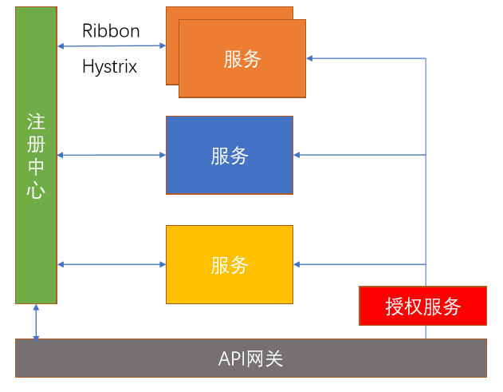
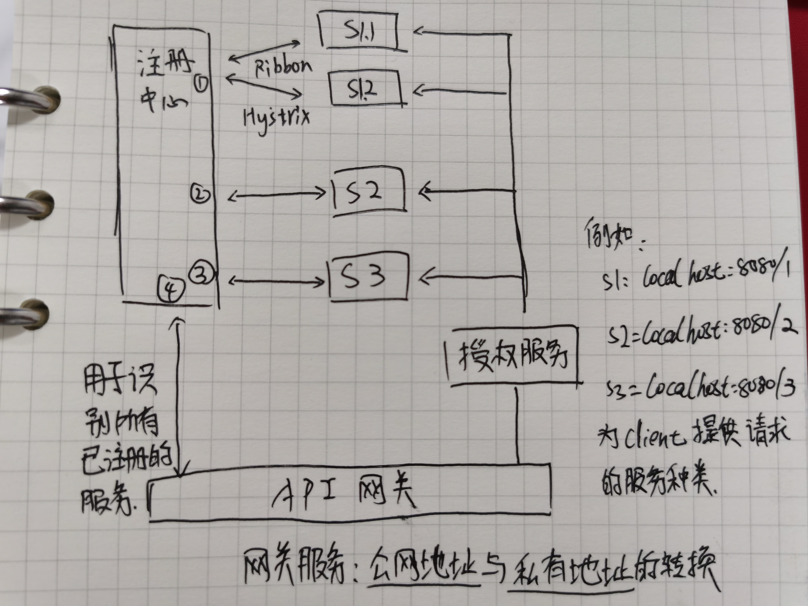

微服务就是一些协同工作的小而自治的服务

### 微服务的优点

**异构性**

- 语言、存储

**弹性**

- 一个组件不可用，不会导致级联故障

**扩展**

- 单体应用不易拓展，多个较小的服务可以按需扩展
- 易于部署 
- 与组织结构对齐
- 可组合性
- 可替代性

------

### 微服务的代价

- **没有银弹**
- 分布式系统的复杂性
- 开发、测试等诸多研发过程中的复杂性
- 部署、监控等诸多运维复杂性

------

### 云原生（Cloud Native）

“云原生技术有利于各组织在公有云、私有云和混合云等新型动态环境中，构建和运行可弹性扩展的应用。”

------

### 云原生应用要求

**DevOps** 

- 开发与运维一同致力交付高品质的软件服务于客户

**持续交付**

- 软件的构建、测试和发布，要更快、更频繁、更稳定

**微服务**

- 以一组小型服务的形式来部署应用

**容器**

- 提供比传统虚拟机更高的效率

------

### Spring Cloud

Spring Cloud是一系列框架的有序集合。它利用Spring Boot的开发便利性巧妙地简化了分布式系统基础设施的开发，如服务发现注册、配置中心、消息总线、负载均衡、断路器、数据监控等，都可以用Spring Boot的开发风格做到一键启动和部署。Spring并没有重复制造轮子，它只是将目前各家公司开发的比较成熟、经得起实际考验的服务框架组合起来，通过Spring Boot风格进行再封装屏蔽掉了复杂的配置和实现原理，最终给开发者留出了一套简单易懂、易部署和易维护的分布式系统开发工具包。

------

### Spring Cloud的主要功能

- 服务发现(Spring Cloud Netflix)
- 服务熔断Netflix Hystrix
- 配置中心Spring Cloud Config
- 服务网关 Zuul
- 分布式消息Spring Cloud Stream

------

### Spring Cloud与Spring Boot关系

Spring Boot 是 Spring 的一套快速配置脚手架，可以基于Spring Boot 快速开发单个微服务，Spring Cloud是一个基于Spring Boot实现的云应用开发工具；Spring Boot专注于快速、方便集成的单个个体，Spring Cloud是关注全局的服务治理框架；Spring Boot使用了默认大于配置的理念，很多集成方案已经帮你选择好了，能不配置就不配置，Spring Cloud很大的一部分是基于Spring Boot来实现,可以不基于Spring Boot吗？不可以。

Spring Boot可以离开Spring Cloud独立使用开发项目，但是Spring Cloud离不开Spring Boot，属于依赖的关系。

spring -> spring boot > Spring Cloud 这样的关系。

------

### 服务熔断

------

### 微服务架构

- 微服务
  - 集群：通过一组集成的计算机软件和/或硬件连接起来高度紧密的协作完成计算机工作。
    - 高性能：通过多台计算机完成同一工作，分摊压力，达到更高的效率
    - 高可用：两机或者多机工作内容、过程一致完全一致，可以相互顶替
  - 分布式：一组计算机通过网络相互连接传递消息与通信并协调它们之间的行为而形成的系统。 组件之间彼此进行交互以实现一个共同的目标。
    - 低耦合：模块之间相互独立，便于扩展，提高资源利用率
    - 高吞吐：功能拆分，分散到不同的模块执行
  - 集群和分布式并不冲突
  - CAP理论：强一致性（C）、极致可用性（A）、分区容错性（P）
- Spring Cloud
  - Spring Cloud 提供了分布式系统的一整套的解决方案
  - Spring Cloud 提供了快速构建分布式系统中一些常见模式的组件
- Spring Cloud 组件

- Spring Cloud 常用组件

  **核心组件：**

  - 服务治理：Spring Cloud **Eureka**

    各个服务启动时，Eureka Client都会将服务注册到Eureka Server，并且Eureka Client还可以反过来从Eureka Server拉取注册表，从而知道其他服务在哪里

  - 负载均衡：Spring Cloud **Ribbon**

    服务间发起请求的时候，基于Ribbon做负载均衡，从一个服务的多台机器中选择一台

  - 熔断限流：Spring Cloud **Hystrix**

    发起请求是通过Hystrix的线程池来走的，不同的服务走不同的线程池，实现了不同服务调用的隔离，避免了服务雪崩的问题

  - 服务调用：Spring Cloud **Feign**

    基于Feign的动态代理机制，根据注解和选择的机器，拼接请求URL地址，发起请求

  - 网关服务：Spring Cloud **Zuul**

    如果前端、移动端要调用后端系统，统一从Zuul网关进入，由Zuul网关转发请求给对应的服务

  **其他组件：**

  - 配置中心：Spring Cloud Config
  - 消息总线：Spring Cloud Bus
  - 消息驱动：Spring Cloud Stream
  - 服务追踪：Spring Cloud Sleuth

- Spring Cloud 思维导图

------

### 服务发现

- Spring Cloud Eureka
  - Eureka Client：服务注册
  - Eureka Server：服务发现
- Spring Cloud Eureka & Consul
  - Consul：保证强一致性 
    - 服务注册相比Eureka会稍慢一些，Consul要求过半的节点都写入成功。
    - Leader 挂掉时，重新选举期整个Consul不可用。
  - Eureka：保证高可用
    - 服务注册快，不需要等待注册信息复制到其他节点，也不保证复制成功。
    - 当注册信息不想同时，每个Eureka节点依然能够正常对外提供服务。

------

### 其他组件

- Spring Cloud 实战
  - 注册中心：Spring Cloud Eureka
  - API网关：Spring Cloud Zuul
  - 用户管理服务：
    - 提供用户信息的增删改查API
    - 数据需要持久化
    - 使用Feign加载用户附加信息
  - 附加信息管理服务：
    - 提供附加信息的增删改查AP
    - 数据需要持久化

- Spring Cloud 常用组件
  - Bibbon：自定义RestTemplate请求
  - Feign：声明性Http请求
  - Hystrix：Http请求熔断

------

### Spring Cloud 网关

- 网关应用场景
  - 认证授权
  - 统一外部入口
  - 请求路由
  - 请求限流
  - 请求日志和监控
- Spring Cloud Zuul
  -  服务路由
  - 自定义过滤器：ZuulFilter
    - filterType() ：过滤类型
    - filterOrder()：过滤顺序
    - shouldFilter()：是否需要过滤
    - run()：过滤逻辑
- Spring Cloud Gateway
  - Spring Cloud Zuul 2.X 之后不再继续维护
  - Spring Cloud Gateway 是由Spring Cloud团队在Zuul 2.X上进行的扩展
