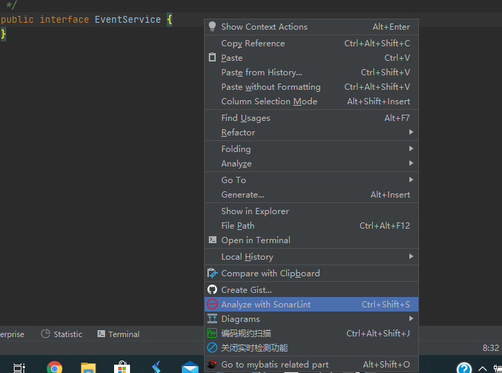

# 人工代码检查

## Review 流程


写完代码后，发送 diff 给指定人 review。待给出意见后，修改代码，继续提交 diff，直到 review 通过。通过 review 的代码由审阅者自动或者手工 Merge 代码到指定分支。多人协作 review 时，第一位阅读者给出粗略意见，第二位看意见是否给的恰当，再补充其他意见。多人同时 review，也可将代码用投影仪打到大屏，共同 review 一段代码。

这里需要思考几个问题：

- review 的分工。有多人参与时需要考虑这个问题。最好有一个总负责人。
- review 的策略。项目初期应该主要考察代码结构是否符合规范，即代码是否放到了相应的位置。项目中期应该以逻辑正确、简化代码、重构现有代码为主要考察点。项目后期主要看程序性能相关的优化问题。
- review 通过的策略。 什么样的代码才能通过 review。 是不是需要完全符合 checklist? 我个人并不赞同完全遵照 checklist。后面我会细说。
- 如何反馈已修改？review 代码的工具一般是 gitlab, reviewboard, gerrit。这些工具都提供了 comments 这一功能。review 的时候可以写下 comments。如果对照 comments 进行修改，那么在 comments 后回复已经修改即可。
- 如何反馈拒绝？这个最好找审阅者当面说清楚:为什么不按照建议编写代码。如果认为自己文笔非凡的也可以在 review 工具中写明白。
- review 修改后再次 review 的策略。要对照之前的 comments 看看编码者是如何修改的。当然也要看看有什么新加入的代码。
- 代码没有必要写完后再 review。可以写一部分 review 一部分。

------

## 阅读代码的技巧

如何阅读别人提交的代码？首先要了解这代码的上下文和需求，不能不负责的指点江山。要充分了解需求，才能考虑如何实现，然后才能审阅别人的代码。不能因为读不懂别人的代码就拒绝别人的代码。这事开源界常发生，但公司内部最好杜绝发生。大家都是同事，低头不见抬头见，没必要关系僵化。你是能炒别人鱿鱼还是你自己要离职呢？看不懂代码可能有三种：一种使用了混淆、一种提交者写的烂、一种审查者能力不足。

混淆代码一般都是有特殊原因的，但不会是故意刁难审阅者。比如说机密的模块、需要隐藏秘钥或算法。这部分代码讲明白意思即可，一般也不需要 review。

如果提交者写的太烂，一般都是 i, j, k 的命名导致。审阅者更应该读懂后，指出哪些地方需要改进：比如少写了注释，改个好名字等。写的烂并不会导致你读不懂，一般是你不愿意花时间去读。如果你说事不关己，没必要看烂的代码。这种心态也不适合进行 Code Review，只适合小作坊编程。不如谦虚谨慎、虚怀若谷。

而最后一个原因：请先提高自身的编程能力！有许多算法精妙难懂，在自己编程水平不足的时候决不能以读不懂为由拒掉。

当你有足够的编程能力时，review 代码时请遵照下面的流程：

> 粗读（知道大概写了哪些内容）
>
> => 抽取重点（架构/类的定义/代码结构）
>
> => 细读代码（简化/重构）
>
> => 逻辑判断 (各分支)
>
> => 细节优化（资源释放，线程安全、算法效率）

- 通过粗读，我们需知提交者改动了什么。是大量修改？还是大量新增？有没有针对性的测试？没有改动配置文件? 有没有改动数据库？
- 我们再仔细看看设计是否恰好符合了需求。是顺序的代码，用到了多线程？还是使用了设计模式？抑或用了第三方组件/架构？是集中式，还是分布式？数据是怎么存储的？单元测试有没有测重点？还有没有更好的设计？
- 再细读一遍代码。挑出繁琐的代码与相似的代码。看是否有简化或重构的可能。嵌套是否太深。是否有难懂的代码。
- 仔细寻找逻辑判读的语句 if，while，for 等。主要看每一个分支是否符合需求，是否是笔误。
- 最后把你的注意力集中在资源释放、线程安全、算法效率上。看看有没有优化的空间。

------

# SonarQube代码检查

## SonarQube 简介

`Sonarqube`为静态代码检查工具，采用`B/S`架构，帮助检查代码缺陷，可以快速的定位代码中潜在的或者明显的错误，改善代码质量，提高开发速度。通过插件形式，可以支持Java、C、C++、JavaScripe等二十几种编程语言的代码质量管理与检测。

通过客户端插件分析源代码，sonar客户端可以采用`IDE`插件、`Sonar-Scanner`插件、`Ant`插件和`Maven`插件方式，并通过各种不同的分析机制对项目源代码进行分析和扫描，并把分析扫描后的结果上传到sonar的数据库，通过sonar web界面对分析结果进行管理。

在公司中，一般是把Sonarqube布置在服务器端，当开发人员提交代码时，Jenkins触发Sonarqube进行代码检查。但是对于开发人员来说，可以在IDEA中可以安装Sonarqube插件，并且在本地或者局域网服务器上安装Sonarqube服务器。这样就可以通过插件连接在本地使用Sonarqube进行代码检查。

Sonarqube可以从七个维度检测代码质量:
	(1) 复杂度分布(complexity)：代码复杂度过高将难以理解
	(2) 重复代码(duplications)：程序中包含大量复制、粘贴的代码而导致代码臃肿，sonar可以展示源码中重复严重的地方
	(3) 单元测试统计(unit tests)：统计并展示单元测试覆盖率，开发或测试可以清楚测试代码的覆盖情况
	(4) 代码规则检查(coding rules)：通过Findbugs,PMD,CheckStyle等检查代码是否符合规范
	(5) 注释率(comments)：若代码注释过少，特别是人员变动后，其他人接手比较难接手；若过多，又不利于阅读
	(6) 潜在的Bug(potential bugs)：通过Findbugs,PMD,CheckStyle等检测潜在的bug
	(7) 结构与设计(architecture & design)：找出循环，展示包与包、类与类之间的依赖、检查程序之间耦合度

------

## 安装SonarQube

- 搭建分两大步：服务端跟客户端，本地开发只需安装`SonarLint`插件即可。

### 服务端

- 前提条件：准备好 `Java` 环境和 `MySql` 数据库

#### 一、Windows系统安装

1、下载 `Sonarqube`，然后解压：http://www.sonarqube.org/downloads/

2、在mysql中新建一个`sonar`数据库

3、修改`~/conf/sonar.properties`配置文件，在Mysql节点下添加数据库信息：

```properties
sonar.jdbc.url=jdbc:mysql://127.0.0.1:3306/sonar?useUnicode=true&characterEncoding=utf8&rewriteBatchedStatements=true&useConfigs=maxPerformance
sonar.jdbc.username=root
sonar.jdbc.password=xxxx
sonar.sorceEncoding=UTF-8
# 登录Sonarqube的用户名和密码
sonar.login=admin
sonar.password=admin
```

4、启动Sonarqube服务

　　进入`~/bin/OS`目录，OS对应自己的操作系统，比如我选择 `~/bin/windows-x86-64/StartSonar.bat`，运行该程序启动服务，在启动过程中会初始化数据库信息。
　　浏览器输入`localhost:9000`访问Sonarqube。

5、配置中文

① 登录，输入`admin/admin`


② 按照如下步骤安装中文包


③ 重启服务，之后就是中文界面啦


④更新`Git`和`Java`分析器


⑤新建一个项目


⑥代码规则里可以配置检查规则


#### 二、Linux系统安装

建议采用Docker Compose方式进行处理，这里不做具体阐述。提供一个Docker Compose文件， [docker-compose.yml](http://hzerodoc.saas.hand-china.com/files/docs/development-specification/backend-development-specification/code-review/docker-compose.yml) 可自行安装调试。

> 操作使用可参考上面Windows安装章节内容

- Sonarqube内网地址：[http://172.20.0.201:9000](http://172.20.0.201:9000/)

### IDEA中开启本地SonarQube规范检查

1. 按照如下步骤安装`SonarLint`插件，安装完成之后重启IDEA


> 配置关联sonar服务端（似乎IDEA2020.1.3不需要配置）
>
> > 全局设置
>
> - Settings -> Other Settings -> SonarLint General Settings
> - 添加sonar服务
>
> > 项目设置
>
> - Settings -> Other Settings -> SonarLint Project Settings
> - 选择刚才配置的sonar服务，关联到本项目。
> - 关联sonar服务之后就会共享服务器上的代码规则。在idea下面一栏找到sonarLint，可以分析单个文件，也可单独分析未提交的代码。

1.项目右键使用SonarLint分析



2.在`Report`里可以看到分析报告，右边可以看到应用的规则，以及给出的解决方式


3.对应的审查类型及严重程度

