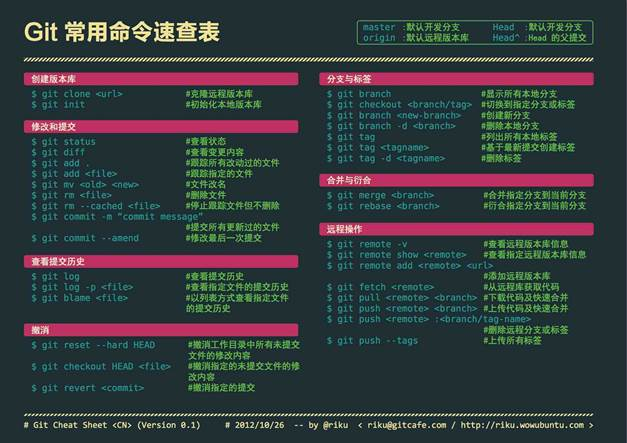
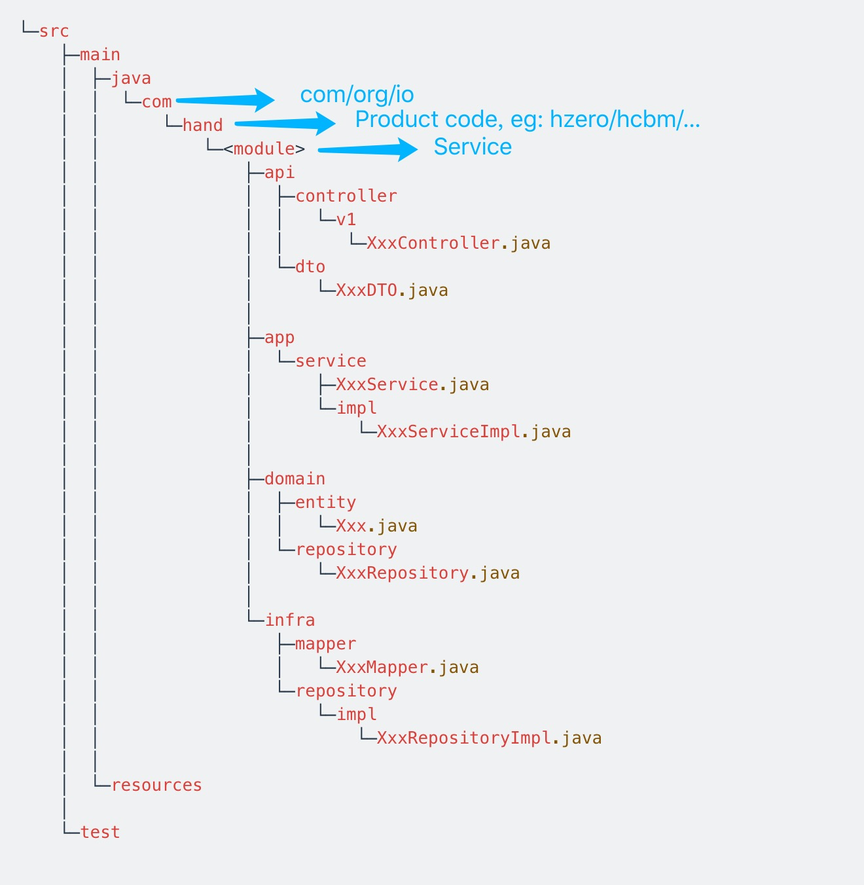
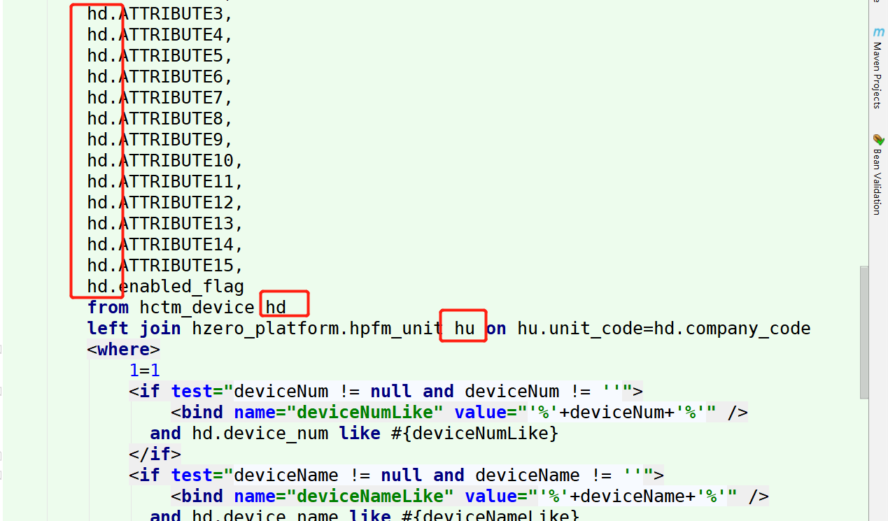

### Git



### 分支命名规约

| 前缀       | 含义                                     |
| ---------- | ---------------------------------------- |
| master     | 主分支，可用的、稳定的、可直接发布的版本 |
| develop    | 开发主分支，最新的代码分支               |
| feature-** | 功能开发分支                             |
| bugfix-**  | 未发布bug修复分支                        |
| release-** | 预发布分支                               |
| hotfix-**  | 已发布bug修复分支                        |

xxx-工号-日期

### 提交命名规约

常见的操作类型有：

- [IMP] 提升改善正在开发或者已经实现的功能
- [FIX] 修正BUG
- [REF] 重构一个功能，对功能重写
- [ADD] 添加实现新功能
- [REM] 删除不需要的文件

### 版本号规范

1. 主版本号：当你做了不兼容的 API 修改。
2. 次版本号：当你做了向下兼容的功能性新增。
3. 修订号：当你做了向下兼容的问题修正。

先行版本号及版本编译信息可以加到“主版本号.次版本号.修订号”的后面，作为延伸

### HZEO目录结构



### 数据表设计规范

- name、code、type、loc、tel 等专有名词需要单独提出来，例如：`xxx_name`、`xxx_code`
- 字段名最好是 name、code 等专有名词作为结尾，例如：`xxx_us_name`√、`xxx_name_us`×
- 是否是 XXX：`is_xxx`
- 主键索引 `id`：自增长
- 唯一索引 `num`：编码规则
- status 状态：
  - 若与当前数据表对象相关联：直接 `status`
  - 若与当前数据表对象无关联：需要加前缀 `xxx_status`

### RESTFUL注意事项

- GetMapping 不支持 @RequestBody，可以改用PostMapping

- GetMapping 支持 @RequestParam

- 注解 @ApiIgnore 会使在Swagger中测试时，用户无法设置  `page`、`size`；解决方式：删除 @ApiIgnore 注解

  [^page]: 第几页，从0开始
  [^size]: 单页大小

```java
@ApiIgnore @SortDefault(value = BankcountInfo.FIELD_BANKCOUNT_ID, direction = Sort.Direction.DESC) PageRequest pageRequest
```

- 不再使用的API接口需要加上 `("/invalid")` 后缀

```java
@PostMapping("/invalid")
```

- Token校验！！！！！！！！！！！！！！！！！！！！！！！！！！！！！！！！！
  - 注意Token校验放置在哪一层
  - 注意Token校验的记录内容（List逐条Token校验）
  - 注意多层List的Token校验（两层Token校验）

### 前后端规范

前后端规范统一下： 

1. 前端页面如果字段太多的话，编辑和新增就用弹框的形式。如果字段比较少，就在行内新增编辑。
2. 后端接口，查询接口有Get，提交接口用POST。提交的数据格式 统一用一个list包在外面(相当于批量新增修改)。
3. 如果是行内新增编辑。新增编辑放在同一个接口里面，通过_status判断。
4. 删除另起一个接口delete，都是批量删除。
5. 接口命名：查询，保存，删除，接口名字都一样，只是提交方法不同，比如，get、delete、post。当存在其他一些操作时，比如作废，直接在原先的接口上面加一个单词，invalid。并且这些接口都是POST

### Loombook注解

少用 `@Date`（甚至不要用），用 `@Setter` / `@getter` 替代

就算是标准 Bean 一般也不要用 `@Date`

> 原因：`@Data` 东西太多了，有些是绝对不能要的

### LOV值集

- 独立值集：存 `code`
  - `@LovValue`
- SQL值集：存 `id`
  - 连表查询

### DB中的规范

- 非数据库字段要加 `@Transient`

> 虽然DTO、VO有时可以不加，但是按照规范加一下，否则如果做增删改保存逻辑就会出问题
>
> 原因：DTO、VO继承了原类，所以这和在entity里面加东西没啥大区别，DTO的作用在于能够区分业务，比如数据库笼统概念bean：
> 	Mysql继承它，加入自己独有的非数据库语法。他就是mysql传递给前端
> 	Oracle继承它，加入自己独有的非数据库语法。他就是oracle传递给前端
> 	Redis继承它，加入自己Nosql的特性。返回给前端Redis
>
> 可以理解为多态
>
> 一般自己的业务，不想污染bean的时候，都会考虑使用DTO。不在原字段加东西。但是对于没有多态的场景，既可以使用DTO也可以使用原生Bean（直接加入非数据库字段），看个人习惯
>
> 非数据库注解还是要加的！！！

- 查询语句表结构要起别名

  
  
- 多语言环境，数据库数据表关联：

```sql
select ut.unit_name from hzero_platform.hpfm_unit u
<bind name="lang" value="@io.choerodon.mybatis.helper.LanguageHelper@language()"/>
join hzero_platform.hpfm_unit_tl ut on u.unit_id = ut.unit_id and ut.lang = #{lang}
where u.unit_id = #{unitId}
```

### 校验

- `validObject` 校验：

  > 一般校验是校验一个对象，对于基本类型装箱就不用校验了
  >
  > 校验是配合对象属性的注解使用，例如 `@NotNull / @NotBlank`
  
- 需要校验的字段：**可以被更改的字段+有必要**

### 其他规范

- 变量与常量比较，常量放前面，同时使用这种常量提出来并维护注释，避免魔法值

[^ 魔法值]: 指在代码中直接出现的数值，只有在这个数值记述的那部分代码中才能明确了解其含义

- 相同类型的常量放在一起，维护上注释，维护人员也可以知道这个有多少种情况，维护注释清楚每个常量的含义，推荐使用枚举代替常量，参考如下：

```java
E:\SpringBoot-module\Constants.java
```

- 注意些，关键的业务节点一定要打日志，`log.info()`

  出现错误时，不用调试看下日志就能找到问题点，这点大家一定要注意，尤其后面UAT和生产环境不能进行调试，很难发现问题，但是我们如果事先对关键业务节点打了日志tag，出现问题，根据日志大概就猜出问题所在了。

```java
log.info("----------XXX:{}----------", XXX);
```

- 常量一般是利于维护所以才设定的，这个是肯定的。不然就没有它存在的意义，只是觉得适合的场景用它维护也方便，也不拖泥带水。所以我建议如果确定会复用的异常进行常量维护，像一些基本只会使用一次的还是不要用常量了吧？可读性太差了

- 如果service方法调用repository中的方法，如果在repository层抛出异常，那service层的事务会回滚吗？

  > 会的，只要你别catch住后不处理，保证错误抛回到service层就会回滚

- 抛出异常，`throw new UtilException("XXX");`，结果图：

  >code和message可以不同，但是这里的不同是针对多语言环境的
  >
  >多语言环境：code是左边编码，message是多语言消息
  >
  >这个报错并不是标准报错，这个是封装的对象返回的，也就是我们前端只要是自定义抛出的异常，返回的状态码都是200

- 更新代码，确定只更新个别字段的优先使用logisticsPlanRepository.updateOptional(logisticsPlanLogisticsPlan.FIELD_PORT_DEPT);不能满足需求再用其他的

  >比如一个实体类只更新portDept字段，优先使用updateOptional

- XML 文件中不能有中文注释！！！！！！！！！！！！